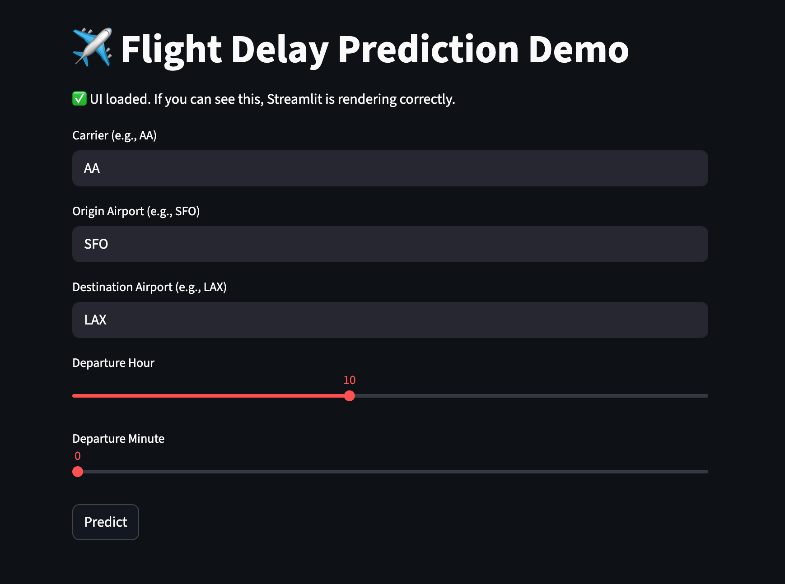

# Flight Delay Prediction Demo ✈️

Author: Mutian He

A lightweight Streamlit demo that predicts **arrival delay (minutes)** for U.S. flights using a trained **CatBoost** model.  
Users input **carrier**, **origin**, **destination**, and **departure time**. The app estimates distance and predicts the expected delay.

> Note: The model file is hosted in **GitHub Releases** and will be **downloaded automatically** on first run.

[](https://flight-delay-demo-2cosxpa3v7dftbbprvtd7z.streamlit.app)

---

## Demo Screenshot


---

## Run Locally
```bash
pip install -r requirements.txt
streamlit run app.py
